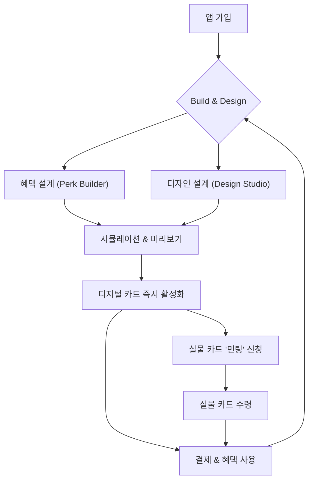

# 프로젝트 컨셉: Flex-Perks 2.0 - The Uncard

## 1. 핵심 비전: "모든 것을 유저가 선택한다"

Flex-Perks는 단순한 금융 상품을 넘어, 유저가 자신의 정체성을 표현하는 **'프로그래머블 캔버스(Programmable Canvas)'**가 되는 것을 목표로 한다. 혜택뿐만 아니라 카드의 디자인까지, 모든 요소를 유저가 직접 실시간으로 설계하고 소유하는 새로운 경험을 제공한다.

---

## 2. 기존 개인화 카드의 한계

기존의 접근법(혜택만 개인화)은 다음과 같은 본질적인 한계를 가진다.

1.  **반쪽짜리 커스터마이징:** 혜택은 유저가 설계하는데, 정작 카드의 '얼굴'인 디자인은 브랜드가 정해준다는 것은 모순이다. 이는 유저를 완전한 '설계자'가 아닌 '선택자'의 위치에 머무르게 한다.
2.  **정적인 브랜드 경험:** 단일 디자인은 초기 임팩트는 강하지만, 시간이 지나면 모든 유저에게 동일한 경험을 제공하며 개인화의 가치가 희석된다.
3.  **'자랑'의 가치 상실:** 카드는 지불 수단인 동시에 타인에게 보여주는 '나'의 일부다. 모두가 똑같은 카드를 쓴다면, 내가 고심해서 설계한 혜택과 디자인을 자랑할 기회가 줄어든다.

---

## 3. 확장된 비전: The Uncard

Flex-Perks는 '혜택'과 '디자인'이라는 두 축을 모두 유저가 프로그래밍하는 동적인 아티팩트(Digital Artifact)로 진화한다. 실물 카드는 앱에서 완성된 디지털 카드를 '민팅(Minting)'한 결과물일 뿐이다.

### 3.1. 디자인 스튜디오 (Design Studio)

앱 내에 'Perk Builder'와 동급의 'Design Studio'를 신설하여, 유저가 'Design Point'를 활용해 카드를 자유롭게 설계한다.

*   **모듈식 커스터마이징:**
    *   **재료 (Material):** 기본 폴리머, 메탈 플레이트, 투명 PVC, 재활용 해양 플라스틱(ESG) 등
    *   **색상 & 마감 (Color & Finish):** 기본 단색, 그라디언트, 매트/홀로그램 마감
    *   **그래픽 & 패턴 (Graphics):**
        *   **기본 패턴:** 미니멀 라인, 도트, 지오메트릭
        *   **아티스트 에디션:** 유명 디지털 아티스트와의 콜라보
        *   **생성형 AI 아트:** 키워드 입력으로 유일무이한 카드 아트워크 즉시 생성
    *   **각인 (Engraving):** 원하는 문구, 이모지, ENS 주소 각인
    *   **LED 시그널 커스텀:** 혜택 적용 시 점멸하는 LED 색상 직접 지정

### 3.2. 디지털 카드 우선주의 (Digital-First)

*   **실시간 동기화:** Design Studio에서 변경한 디자인은 즉시 앱과 Apple/Google Pay의 디지털 카드에 반영된다.
*   **움직이는 카드 (Animated Card):** 디지털 카드 한정, 생성형 AI 아트를 미세하게 움직이는 Live Wallpaper처럼 구현하여 시각적 만족도를 극대화한다.

### 3.3. 실물 카드는 '민팅(Minting)' 개념으로

*   **연 1회 무료 민팅:** 기본 구독자는 매년 현재의 디지털 카드 디자인을 실물 카드로 무료 제작.
*   **유료 추가 민팅:** 원할 때마다 제작 실비 기반의 비용으로 새로운 디자인의 실물 카드 추가 제작.
*   **NFT 연동:** 유저가 소유한 NFT를 카드 디자인으로 '임포트'하는 기능 제공.

---

## 4. 새로운 유저 여정 (User Journey 2.0)

유저 여정은 혜택과 디자인 설계를 끊임없이 오가는 순환 구조를 가진다.

---

## 5. 결론

이 접근법은 Flex-Perks를 단순한 '혜택 좋은 카드'에서 **'나를 표현하는 프로그래머블 캔버스'** 로 탈바꿈시킨다. 유저는 자신의 소비 패턴뿐만 아니라, 미적 취향까지 반영된 단 하나뿐인 금융 경험을 갖게 되어 강력한 락인(Lock-in) 효과와 바이럴 루프(Viral Loop)를 만들어낼 것이다.